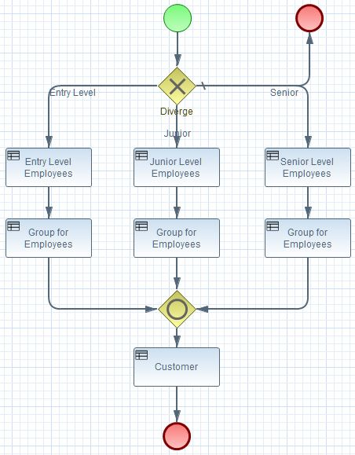
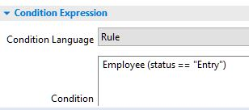

<p align='right'>
<small>Sunil Samuel<br>
web_github@sunilsamuel.com<br>
http://www.sunilsamuel.com
</small>
</p>

<font size="8">**<p align='center'><font size="8" color="red">BRMS Aggregator</p>**</font>

# Overview

Just a sample application using Drools (BRMS).  The objective is to show the following:
1. BPMN Process with Exclusive (XOR) Gateway :: Create a XOR gateway with branches using 
   Rules
2. Reuse RuleGroup :: Different Paths in Process Reusing the Same Rule Group
3. Multiple Project Structure :: Include Rules Defined within Another Maven Project (kjar)

# BPMN Process with Exclusive (XOR) Gateway

This is an extremely simple example of how to use rules to define the branches within 
a gateway.  For this case, I use a XOR gateway, but thi example can be applicable to 
any gateway.

The goal is to use Rules within the branches so that we do not have to insert process 
instance variables into the process. 


In the above BPMN process, the XOR has 4 branches, namely `Entry Level`, `Junior`, `Senior`, 
and default to end.  The condition for each will look similar to the following:


where the condition ia a BRMS rule.  More details can be seen when clicking on the Properties 
tab for the BPMN.

# Reuse RuleGroup

A simple way to reuse a RuleGroup is to repeat the group as a new Business Rule Task 
within each of the paths.  The `Group for Employees` Business Rule Task is used within 
each of the three paths.  There are other ways to do this, but this is just an example 
of how it can be done.

# Multiple Project Structure

In some cases, it is necessary to include other RuleGroups from other KJARs within the current 
project.  That is, a RuleGroup (part of an external KJAR) that was a maven dependency to another 
project is included within this project.

The first step is to make the `kmodule.xml` file aware of this dependency that has been 
included via maven pom.

```xml
<?xml version="1.0" encoding="UTF-8"?>
<kmodule xmlns:xsi="http://www.w3.org/2001/XMLSchema-instance" xmlns="http://www.drools.org/xsd/kmodule">
    <configuration>
        <property key="drools.propertySpecific" value="ALWAYS" />
    </configuration>

    <kbase name="diversionKieBase" default="false" packages="com.sunilsamuel.diversion.rules" includes="customerKieBase">
        <ksession name="diversionStateLess" default="false" type="stateless" />
    </kbase>
</kmodule>
```

The `kmodule.xml` definition above `includes` the dependent KieBase.  Once that is done, 
then we can use this into the BPMN process.  For additional information, inspect the BPMN. 

# Testing Framework
The testing framework within the `rules-test-support` project can be used to test the BRMS project within the BDD Cucumber framework.  The `RulesEngineSupport` class supports testing the rules as a BPMN Process, BPMN Task (ruleflow group), and as an individual rule basis.

## Testing BPMN Process
The BPMN Process can be tested end-to-end by using the Process Id.

```
rulesEngineSupport = new RulesEngineSupport();
rulesEngineSupport.addFact(employee);
rulesEngineSupport.setSessionName("customerStatefulSession");
//
// Set the Process Id name (name of the BPMN id)
//
rulesEngineSupport.addProcess("com.sunilsamuel.diversion.rules.process");
rulesEngineSupport.setDebug(false);
rulesEngineSupport.fireRules();
rulesEngineSupport.executeRules();
```

## Testing BPMN Task (Ruleflow Group)
The BPMN Task can be tested using the `ruleflow-group` name.

```
rulesEngineSupport = new RulesEngineSupport();
rulesEngineSupport.addFact(employee);
rulesEngineSupport.setSessionName("customerStatefulSession");
//
// Set the ruleflow-group name
//
rulesEngineSupport.setRuleFlowName("Customer");
rulesEngineSupport.setDebug(false);
rulesEngineSupport.fireRules();
rulesEngineSupport.executeRules();
```

## Individual Rule
Each individual rule can be tested by activating the rule name.

```
rulesEngineSupport = new RulesEngineSupport();
rulesEngineSupport.addFact(employee);
rulesEngineSupport.setSessionName("customerStatefulSession");
//
// Set the name of the rule to activate
//
rulesEngineSupport.setRuleNameToActivate("Process Customer");
rulesEngineSupport.setDebug(false);
rulesEngineSupport.fireRules();
rulesEngineSupport.executeRules();
```

# Technology Stack

* BRMS
* BPMN
* Maven
