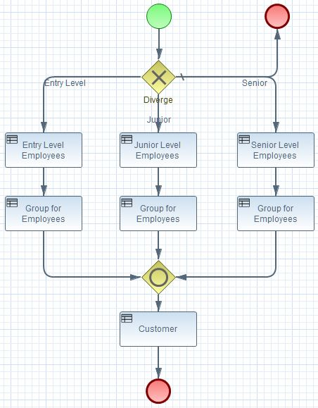

<small>Sunil Samuel 
web_github@sunilsamuel.com 
http://www.sunilsamuel.com
</small>

**
BRMS Aggregator
**

# Overview

Just a sample application using Drools (BRMS).  The objective is to show the following:
1. BPMN Process with Exclusive (XOR) Gateway :: Create a XOR gateway with branches using 
   Rules
2. Reuse RuleGroup :: Different Paths in Process Reusing the Same Rule Group
3. Multiple Project Structure :: Include Rules Defined within Another Maven Project (kjar)

# BPMN Process with Exclusive (XOR) Gateway

This is an extremely simple example of how to use rules to define the branches within 
a gateway.  For this case, I use a XOR gateway, but thi example can be applicable to 
any gateway.

The goal is to use Rules within the branches so that we do not have to insert process 
instance variables into the process. 
